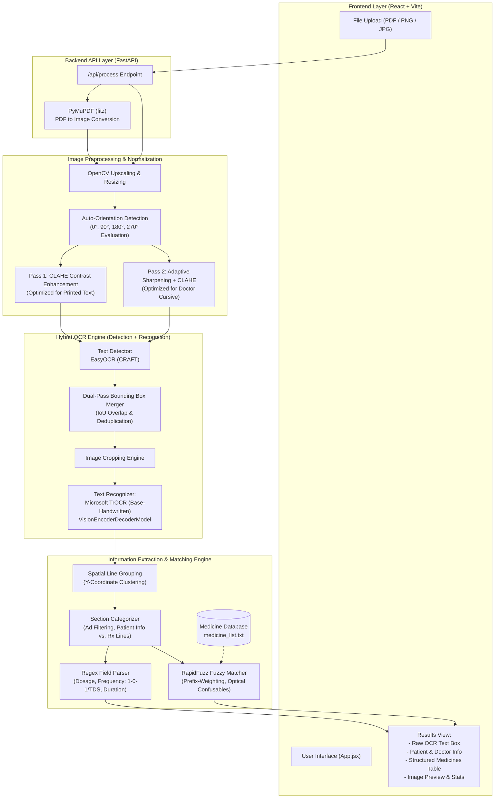

# AI Prescription OCR 🏥

An end-to-end AI system that accepts **handwritten doctor prescription images or PDFs** and extracts structured medicine data. It features a modern React frontend and a FastAPI Python backend powered by a **Hybrid OCR Engine** (EasyOCR CRAFT for text detection + Microsoft TrOCR for text recognition).

---

## 🏛️ System Architecture



---

## 📁 Project Structure

```text
Prescription/
├── backend/
│   ├── app/
│   │   ├── main.py                    # FastAPI server & endpoints
│   │   ├── ocr_service.py             # Preprocessing & Hybrid OCR (EasyOCR + TrOCR)
│   │   ├── utils.py                   # Image & PDF handling helpers
│   │   ├── data/medicine_list.txt     # Medical knowledgebase (324+ medicines)
│   │   └── services/extraction/       # Parsing logic (regex, RapidFuzz matching)
├── frontend/
│   ├── src/App.jsx                    # Main React UI component
│   ├── src/App.css                    # UI styling
│   ├── package.json                   # Node dependencies
│   └── vite.config.js                 # Vite configuration
├── requirements.txt                   # Python backend dependencies
└── README.md                          # This documentation
```

---

## ⚙️ Setup & Installation

### 1. Backend Setup (FastAPI + Python)

Create a virtual environment and install the dependencies:
```bash
python -m venv venv

# Windows
venv\Scripts\activate
# Mac/Linux
source venv/bin/activate

pip install -r requirements.txt
```

Start the FastAPI backend server:
```bash
cd backend
uvicorn app.main:app --host 0.0.0.0 --port 8000 --reload
```
> **Note:** The backend uses Heavy ML models. Upon first run, EasyOCR models (~100MB) and TrOCR models (~1.5GB) will be downloaded automatically via HuggingFace.

### 2. Frontend Setup (React + Vite)

Open a new terminal window, navigate to the frontend directory, and install the Node dependencies:
```bash
cd frontend
npm install
```

Start the Vite development server:
```bash
npm run dev
```

The frontend will run at **http://localhost:5173**. Open this URL in your browser to access the web application.

---

## 🚀 Key Features

1. **Auto-Orientation & PDF Support**: 
   Automatically detects rotated images (90, 180, 270 degrees) to ensure maximum OCR accuracy, and seamlessly processes PDF uploads (multipages are parsed and converted using `PyMuPDF`).
2. **Hybrid OCR Pipeline**: 
   Uses **EasyOCR (CRAFT model)** for robust bounding box detection and **Microsoft TrOCR** for state-of-the-art handwritten text recognition via Vision Transformers.
3. **Advanced Optical Normalization Matching**: 
   Extracts and aligns misspelled handwritten outputs to a curated 324-medicine knowledgebase. It uses generic regex patterns and a dynamically weighted `RapidFuzz` algorithm mapped with known doctor optical confusions (e.g. `1 ↔ l`, `rn ↔ m`, `m ↔ n`) to correctly classify medicines from terrible cursive output.
4. **Structured JSON API**: 
   The backend `/api/process` automatically parses unstructured blocks of text into cleanly formatted Patient Data, and Medicine Objects (Name, Confidence, Dosage, Frequency, Duration).
