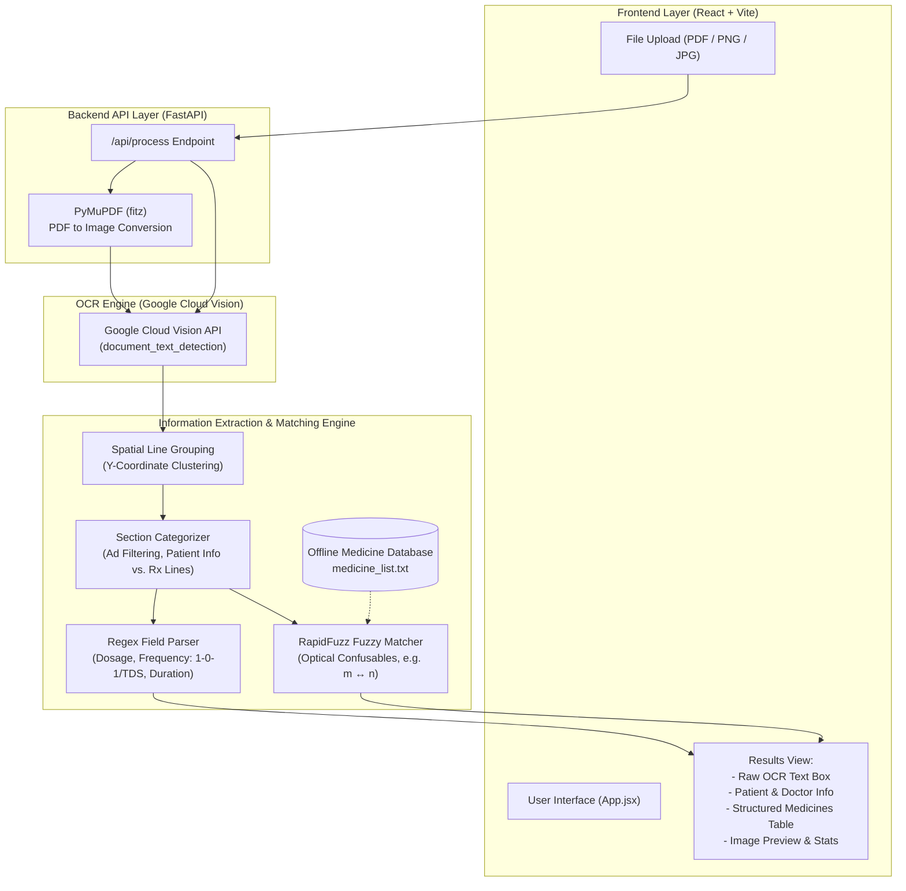

# AI Prescription OCR 🏥

An end-to-end AI system that accepts **handwritten doctor prescription images or PDFs** and extracts structured medicine data. It features a modern React frontend and a FastAPI Python backend powered by **Google Cloud Vision API** for high-accuracy handwriting recognition.

---

## 🏛️ System Architecture



---

## 📁 Project Structure

```text
Prescription/
├── backend/
│   ├── app/
│   │   ├── main.py                    # FastAPI server & endpoints
│   │   ├── ocr_service.py             # Google Cloud Vision integration & categorisation
│   │   ├── utils.py                   # Image & PDF handling helpers
│   │   ├── data/medicine_list.txt     # Medical knowledgebase (324+ medicines)
│   │   └── services/extraction/       # Parsing logic (regex, RapidFuzz matching)
│   ├── .env.example                   # Template for environment variables
├── frontend/
│   ├── src/App.jsx                    # Main React UI component
│   ├── src/App.css                    # UI styling
│   ├── package.json                   # Node dependencies
│   └── vite.config.js                 # Vite configuration
├── requirements.txt                   # Python backend dependencies
└── README.md                          # This documentation
```

---

## ⚙️ Setup & Installation

### 1. Backend Setup (FastAPI + Python)

Create a virtual environment and install the dependencies:
```bash
python -m venv venv

# Windows
venv\Scripts\activate
# Mac/Linux
source venv/bin/activate

pip install -r requirements.txt
```

**Environment Variables:**
Create a `.env` file in the `backend/` directory and add your Google Vision API key:
```env
GOOGLE_VISION_API_KEY=your_google_cloud_vision_api_key_here
```

Start the FastAPI backend server:
```bash
cd backend
uvicorn app.main:app --host 0.0.0.0 --port 8000 --reload
```

### 2. Frontend Setup (React + Vite)

Open a new terminal window, navigate to the frontend directory, and install the Node dependencies:
```bash
cd frontend
npm install
```

Start the Vite development server:
```bash
npm run dev
```

The frontend will run at **http://localhost:5173**. Open this URL in your browser to access the web application.

---

## 🚀 Key Features

1. **Google Cloud Vision OCR**: 
   Leverages industry-leading Cloud Vision API (`document_text_detection`) to accurately read terrible doctor handwriting, even heavily cursive scripts.
2. **Robust Multi-format Support**: 
   Seamlessly processes PDF uploads (multipages are parsed and converted using `PyMuPDF`) as well as standard images (JPG, PNG).
3. **Advanced Optical Normalization Matching**: 
   Extracts and aligns misspelled handwritten outputs to a curated 324-medicine local knowledgebase. It uses generic regex patterns and a dynamically weighted `RapidFuzz` algorithm mapped with known doctor optical confusions (e.g. `1 ↔ l`, `rn ↔ m`, `m ↔ n`) to correctly classify medicines from raw OCR output.
4. **Offline Medical Dictionary**:
   Blazing fast extraction using a local `medicine_list.txt` dictionary—ensuring speed and privacy with zero external API hallucinations.
5. **Structured JSON API**: 
   The backend `/api/process` automatically parses unstructured blocks of text into cleanly formatted Patient Data, and Medicine Objects (Name, Confidence, Dosage, Frequency, Duration).
